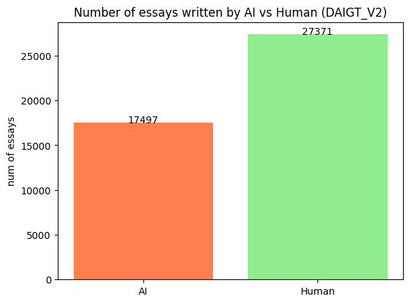

# LLM-generated text detection - Student essays
This is the GitHub repo for the **CS6120: Natural Language Processing**'s final project. The goal is to build a machine-learning model that can detect whether an essay is written by a student or AI-generated, which is based on a recent Kaggle competition: [LLM - Detect AI Generated Text](https://www.kaggle.com/competitions/llm-detect-ai-generated-text). Refer to the following sections for the solution's summary, model training code, and hardware specifics.

## Dataset
* [DAIGT_V2 dataset](https://www.kaggle.com/datasets/thedrcat/daigt-v2-train-dataset) (including original competition's dataset):
    * 17497 human essays
    * 27371 LLM essays

## Our approach