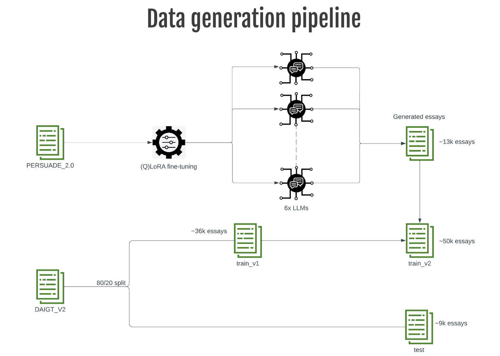
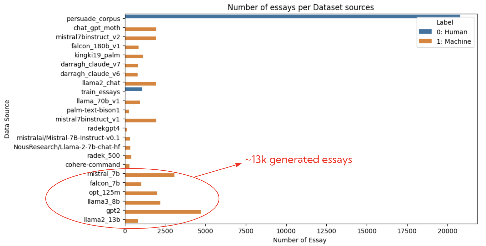
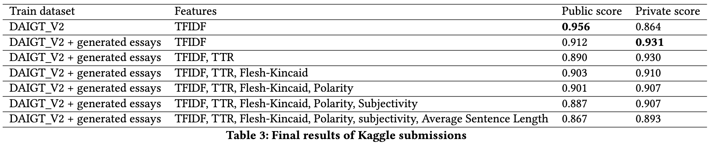

# LLM-generated text detection - Student essays
This is the GitHub repo for the **CS6120: Natural Language Processing**'s final project. The goal is to build a machine-learning model that can detect whether an essay is written by a student or AI-generated, which is based on a recent Kaggle competition: [LLM - Detect AI Generated Text](https://www.kaggle.com/competitions/llm-detect-ai-generated-text). Refer to the following sections for the solution's summary, model training code, and hardware specifics.

## Dataset
* [Competition dataset](https://www.kaggle.com/competitions/llm-detect-ai-generated-text/data)

* [DAIGT_V2 dataset](https://www.kaggle.com/datasets/thedrcat/daigt-v2-train-dataset) (including original competition's dataset)

* [PERSUADE corpus](https://www.kaggle.com/datasets/nbroad/persaude-corpus-2)

**Classes mapping**

|  Class | Numeric label|
|---|---|
| Human written essays  | 0 |
| LLM-generated essays  | 1 |

## Our approach


To improve our model generalization capability, we proposed a small pipeline for augmenting our dataset. Specifically, we  instruction tuned 6 LLMs on the **PERSUADE corpus** using **(Q)LoRA** which were then used for generating essays. The final dataset includes:
* 80% DAIGT_V2 (~36.000 essays)
* ~13.000 essays generated from our finetuned LLMs including: mistral_7b, falcon_7b, opt_125m, llama3_8b, gpt2, and llama2_13b

This results in a total of **~50.000 essays** for training, and **~9.000** for testing (20% DAIGT_V2).




### Final models
Our final models includes:
- (Q)LoRA fine-tuning of Mistral-7B
- An ensemble of 4 classfiers including MultinomialNB, SGD, LGBM, and CatBoost, using TFIDF and NLP characteristics as features.

### Performance on Kaggle public & private test


## Section 1: Setup
### 1.1 Hardware
All of our experiments were being conducted by submitting **Slurm jobs** to **NURC (Northeastern University Research Computing)** platform, thanks to Professor [Shanu Sushmita](https://www.khoury.northeastern.edu/people/shanu-sushmita/)'s sponsor.

Job Resource specifications:
- 12 vCPUs
- 2 x NVIDIA A100 40GB GPU
- 64GB RAM

### 1.2 Software

* anaconda3/2022.05 module
* Python 3.10.11
* CUDA 12.1

### 1.3 Dependencies
Please clone the repository and install the required packages using the following commands:

```
git clone https://github.com/trungnq0202/llm-generated-text-detection.git
cd llm-generated-text-detection
pip install -r requirements.txt
```

### 1.4 Datasets
Make sure Kaggle API is installed. 
```
pip install kaggle
```

Run the following script to download the required datasets:
```
chmod +x ./setup.sh
./setup.sh
```

The above script will download the required datasets in the `data` folder having structure as follows:
```
llm-generated-text-detection/
  │
  ├── models/ - all fine-tuned LLMs checkpoints
  |
  ├── data/
  │   ├── DAIGT_V2/
  |        ├── ***.csv
  │        └── ...
  |   ├── persuade_2/
  |        ├── ***.csv
  │        └── ...
  |   ├── scaling/ - generated essays
  │   └── llm-detect-ai-generated-text/
  │
  └── ...
```
CSV files in `persuade_2` will be used for instruction tuning the 6 LLMs for essays generation, while the ones in `DAIGT_V2` will be used for training as well as validation.


## Section 2: Essays generation
### 2.1: Instruction tuning 
We fine-tuned 6 LLMs using (Q)LoRA on the [PERSUADE](https://www.kaggle.com/datasets/nbroad/persaude-corpus-2) corpus to produce student-like essays. These following scripts submit Slurm jobs to the NURC for executing the fine-tuning. Checkpoints are saved to the `models` folder lying in the same directory level as `data`.

```bash
bash src/instruction_sft/instruction_sft_falcon_7b_slurm.sh

bash src/instruction_sft/instruction_gpt2_slurm.sh

bash src/instruction_sft/instruction_llama2_13b_slurm.sh

bash src/instruction_sft/instruction_llama3_8b_slurm.sh

bash src/instruction_sft/instruction_sft_mistral_7b_slurm.sh

bash src/instruction_sft/instruction_sft_opt_125m_slurm.sh

```

### 2.2: Essays Generation
Those following scripts are used to generate essays using the 6 fine-tuned LLMs from the previous step. The generated data are saved to the `scaling` folder within `data`.

```bash
bash src/text_generation/text_generation_falcon_7b_slurm.sh

bash src/text_generation/instruction_gpt2_slurm.sh

bash src/text_generation/instruction_llama2_13b_slurm.sh

bash src/text_generation/instruction_llama3_8b_slurm.sh

bash src/text_generation/text_generation_mistral_7b_slurm.sh

bash src/text_generation/text_generation_opt_125m_slurm.sh
```

### 2.3: Finalize train/test data
To combine the generated essays with DAIGT_V2 to produce our final train/test split, run the following script:

```
python prepare_data.py --data_dir data --output_dir data/final
```

This will create 3 csv files in the `final` folder within `data`:
```
llm-generated-text-detection/
  |
  ├── data/
  │   ├── final/
  |         ├── train_essays_v1.csv - (80% DAIGT_V2)
  │         ├── train_essays_v2.csv - (80% DAIGT_V2 + generated essays)
  |         └── test_essays.csv - (20% DAIGT_V2)
  |   └── ...
  │
  └── ...
```

## Section 3: Classifier training & inference
For (Q)LoRA fine-tuning Mistral-7B as the classifier, run the following:
```
bash src/detection_sft/detection_sft_mistral_7b_slurm.sh
```


